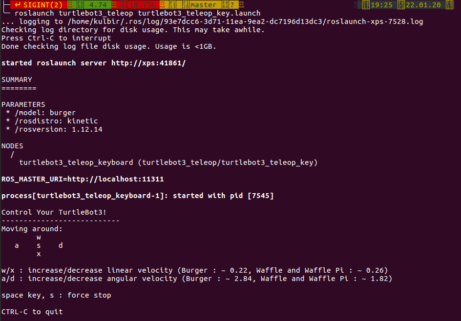

# Turtlebot_3_PID
ROS package to simulate Turtlebot 3 Waffle/ Burger in Gazebo. The turtlebot starts at a random position and goes to the goal position input by the user.

YouTube video explanation: https://youtu.be/znWkFWk76XQ

# Running instructions
First of all, copy the package control_bot in the src folder of your workspace. Then do:
```bash
cd ~/your_workspace
# our workspace in this case is the "catkin_ws"
catkin_make
```
To launch roscore:-
```zsh
#source ~/catkin_ws/devel/setup.bash #for bash users
source ~/catkin_ws/devel/setup.zsh
export TURTLEBOT3_MODEL=waffle #for waffle
roslaunch turtlebot3_gazebo turtlebot3_empty_world.launch
```

To run the python file, do:
```zsh
#source ~/catkin_ws/devel/setup.bash #for bash users
source ~/catkin_ws/devel/setup.zsh
#to make the python file executable:-
cd ~/catkin_ws/src/control_bot/Scripts
chmod +x final.py 
#then run the python file:-
rosrun control_bot final.py
#rosrun control_bot PID_test1.py   #only if you want to test it
```
Enter the ranges for generating the random start and end poses. The turtlebot will go to the goal position using a PID controller.


Note for an older version - The command ```roslaunch control_bot gazebo_user.launch x_pos:={0} y_pos:={1} z_pos:={2}```
is executed by using ```subprocess.Popen``` in the python code file "final.py" in the src folder of control_bot.

# Installation of required packages for ROS Melodic
The following packages need to be installed first:-
```
$ sudo apt-get install ros-melodic-ar-track-alvar
$ sudo apt-get install ros-melodic-ar-track-alvar-msgs
```

Go to the source folder of the catkin_ws workspace:-
```
cd ~/catkin_ws/src/ 
```

Then, clone the following repositories into your workspace:-
```zsh
git clone https://github.com/ROBOTIS-GIT/turtlebot3.git
git clone https://github.com/ROBOTIS-GIT/turtlebot3_msgs.git  
git clone https://github.com/ROBOTIS-GIT/turtlebot3_applications_msgs.git  
git clone https://github.com/ROBOTIS-GIT/turtlebot3_simulations.git 
#git clone https://github.com/ROBOTIS-GIT/turtlebot3_applications.git  
```

Change the working directory to catkin_ws and then use catkin_make:-
```
cd ~/catkin_ws && catkin_make
```

Reference - ROS Robot Programming book - Page 285 - https://www.pishrobot.com/wp-content/uploads/2018/02/ROS-robot-programming-book-by-turtlebo3-developers-EN.pdf

Install these packages:-
```
sudo apt-get install ros-melodic-teleop-twist-keyboard  
sudo apt-get install ros-melodic-turtlebot3
sudo apt-get install ros-melodic-joy ros-melodic-joystick-drivers ros-melodic-teleop-twist-joy
```
To source the catkin workspace if you're using bash:-
```
source devel/setup.bash
```
To source the catkin workspace if you're using zsh:-
```
source ~/catkin_ws/devel/setup.zsh
```


Then, export the type of Turtlebot 3 that you want.
```
export TURTLEBOT3_MODEL=waffle #for waffle  
export TURTLEBOT3_MODEL=burger #for burger  
```
To open empty world in gazebo with Turtlebot3 in it:-
```
roslaunch turtlebot3_gazebo turtlebot3_empty_world.launch  
```
## Moving the Turtlebot
We can move the turtlebot by:-
1. Publishing to the concerned topics
2. Using teleop.launch which takes inputs from the user using the keyboard.

### By publishing to the topic /cmd_vel
1. To control the velocity of the robot, we publish to the topic **/cmd_vel**. 
2. Use the command **rostopic info /cmd_vel** to see the type of message required to be sent to the topic, the publishers to the topic and the subscribers to the topic.
3. Use **rosmsg show geometry_msgs/Twist** to see the details of the message type.
4. Then use the command to enter the velocities manually:-
```
rostopic pub /cmd_vel geometry_msgs/Twist "linear:
  x: 0.0
  y: 0.0
  z: 0.0
angular:
  x: 0.0
  y: 0.0
  z: 0.0"
```
### By controlling the robot using the keyboard 
We can use the  keyboard_teleop.launch file to control the Turtlebot 3 using inputs from the keyboard using the commands:-
```
export TURTLEBOT3_MODEL=burger #for burger
roslaunch turtlebot3_teleop turtlebot3_teleop_key.launch
```
You will get the following menu:-
 </div>


Run final.py by going into:-
```
~/catkin_ws/src/Turtlebot3/control_bot/src$
```


# Installation of required packages for ROS kinetic
ROS package to simulate Turtlebot 3 Waffle/ Burger in Gazebo. The turtlebot starts at a random position and goes to the goal position input by the user.

The following packages need to be installed first:-
```
$ sudo apt-get install ros-kinetic-ar-track-alvar
$ sudo apt-get install ros-kinetic-ar-track-alvar-msgs
```

Go to the source folder of the catkin_ws workspace:-
```
cd ~/catkin_ws/src/ 
```

Then, clone the following repositories into your workspace:-
```
 
git clone https://github.com/ROBOTIS-GIT/turtlebot3.git   
git clone https://github.com/ROBOTIS-GIT/turtlebot3_msgs.git   
git clone https://github.com/ROBOTIS-GIT/turtlebot3_applications_msgs.git  
git clone https://github.com/ROBOTIS-GIT/turtlebot3_simulations.git  
git clone https://github.com/ROBOTIS-GIT/turtlebot3_applications.git  
```

Change the working directory to catkin_ws and then use catkin_make:-
```
cd ~/catkin_ws && catkin_make
```

Reference - ROS Robot Programming book - Page 285 - https://www.pishrobot.com/wp-content/uploads/2018/02/ROS-robot-programming-book-by-turtlebo3-developers-EN.pdf

Install these packages:-
```
sudo apt-get install ros-kinetic-teleop-twist-keyboard  
sudo apt-get install ros-kinetic-turtlebot3
sudo apt-get install ros-kinetic-joy ros-kinetic-joystick-drivers ros-kinetic-teleop-twist-joy
sudo apt-get install ros-kinetic-turtlebot-bringup ros-kinetic-turtlebot-navigation ros-kinetic-rtabmap-ros
```
To source the catkin workspace if you're using bash:-
```
source devel/setup.bash
```
To source the catkin workspace if you're using zsh:-
```
source ~/catkin_ws/devel/setup.zsh
```


Then, export the type of Turtlebot3 that you want.
```
export TURTLEBOT3_MODEL=waffle #for waffle  
export TURTLEBOT3_MODEL=burger #for burger  
```
To open empty world in gazebo with Turtlebot3 in it:-
```
roslaunch turtlebot3_gazebo turtlebot3_empty_world.launch  
```
## Moving the Turtlebot
We can move the turtlebot by:-
1. Publishing to the concerned topics
2. Using teleop.launch which takes inputs from the user using the keyboard.

### By publishing to the topic /cmd_vel
1. To control the velocity of the robot, we publish to the topic **/cmd_vel**. 
2. Use the command **rostopic info /cmd_vel** to see the type of message required to be sent to the topic, the publishers to the topic and the subscribers to the topic.
3. Use **rosmsg show geometry_msgs/Twist** to see the details of the message type.
4. Then use the command to enter the velocities manually:-
```
rostopic pub /cmd_vel geometry_msgs/Twist "linear:
  x: 0.0
  y: 0.0
  z: 0.0
angular:
  x: 0.0
  y: 0.0
  z: 0.0"
```
### By controlling the robot using the keyboard 
We can use the  keyboard_teleop.launch file to control the Turtlebot 3 using inputs from the keyboard using the commands:-
```
export TURTLEBOT3_MODEL=burger #for burger
roslaunch turtlebot3_teleop turtlebot3_teleop_key.launch
```
You will get the following menu:-
 </div>


Run final.py by going into:-
```
~/catkin_ws/src/Turtlebot3/control_bot/src$
```

## References:-
1. Robot Ignite Academy: Mastering with ROS: Turtlebot3
2. ROS Robot Programming book - Page 285 - https://www.pishrobot.com/wp-content/uploads/2018/02/ROS-robot-programming-book-by-turtlebo3-developers-EN.pdf


